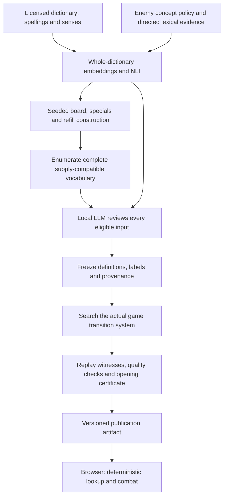

# WYRMLE: generation, semantic compilation and certification

This is a technical account of the implementation, with separate claims for vocabulary coverage, semantic judgement and game solvability. The central design is a **compiler boundary**: expensive, probabilistic semantic work happens during authoring; gameplay and solver transitions use the same immutable, versioned table.

## 1. Vocabulary coverage is a finite enumeration problem

Let \(D\) be the accepted, definition-backed dictionary, \(S(w)\) the licensed source senses of spelling \(w\), and \(\nu(w)\in\mathbb N^{26}\) its letter-count vector. For a candidate with initial board \(B\), finite refill sequence \(Q\), minimum word length \(m\), and board capacity \(n=16\), compile

\[
D_P=\{w\in D:m\leq |w|\leq n,\quad\nu(w)\leq\nu(B)+\nu(Q)\}.
\]

The inequality is componentwise. This is a **complete superset** of words playable on any reachable board: it ignores timing, consumption and refill order. It can include unreachable words, but cannot omit a reachable spelling. The compiler examines this set independently of solver budgets; a beam-search cutoff therefore cannot remove a word's definition or silently make it neutral.

The current source export has **116,395 spellings, 112,646 distinct senses and 244,273 spelling–sense references**. Definitions come from Open English Wordnet plus the licensed Wiktionary supplement for uncovered words, including function words. An admitted spelling must have a stored source definition. The LLM does not invent definitions or decide spelling validity.

The original failure was principally sparse semantic coverage: the compiler found spellings, but absence from a small enemy relation profile implied neutrality. Enumerating \(D_P\) did not imply evaluating its meanings. The replacement removes that fallback.

## 2. Semantic classification is a policy over senses

For each enemy \(e\), an authored concept policy supplies counter and reinforcing anchors \(A_e^-\) and \(A_e^+\), with source sense identifiers. This is game semantics: *calm* counters *chaos* through composure/order; it need not be a strict dictionary antonym. Related negative emotions are not interchangeable. The assessed enemy set is ANGER, CHAOS, CRUELTY, DESPAIR, FEAR and MELANCHOLY; adding an enemy requires its policy, complete offline assessment and evaluation, not merely another seed.

### Retrieval and directional evidence

The base model embeds lemma-plus-definition strings with pinned **all-MiniLM-L6-v2**. After mean pooling and normalization, similarity is the dot product of 384-dimensional vectors. For each source sense, retrieve up to four anchors **on each side**, subject to cosine similarity at least \(0.50\). A pinned **nli-deberta-v3-xsmall** then evaluates directional entailment between the candidate definition and each retrieved anchor definition.

Cosine similarity alone is unsuitable for polarity: antonyms often occupy similar contexts. NLI provides a second, asymmetric signal. The statistical base decision takes the strongest entailment, breaking ties by cosine; scores below \(0.55\) produce neutrality. Stored per-side scores are maxima over the word's assessed senses and retrieved anchors. They are model outputs, **not calibrated human-agreement probabilities**.

Source evidence has explicit precedence:

1. Existing reviewed scoring senses and their lexical expansions.
2. A directed source proof reaching an approved concept in at most two edges.
3. The vector/NLI decision.

Proof edges are forward `hypernym`, `entails` or `causes`; an optional verb-to-state/event noun role consumes one of the two hops. Sharing a hypernym does not constitute a proof. Hypernym inheritance into a collective `noun.group` anchor is also insufficient: belonging to a series does not imply countering disorder. Those candidates fall through to ordinary statistical and contextual review. Excluded senses and intermediate concepts are respected. The selected source, path and decision basis remain inspectable.

### Contextual refinement

A second retrieval index uses the union of three representations: **lemma + definition, definition alone, and lemma alone**. Let

\[
q_e(s)=\max_{r\in\{\ell d,d,\ell\}}\max_{a\in A_e^-\cup A_e^+}
\langle f_r(s),f_r(a)\rangle.
\]

The local LLM must review every novel statistical positive, and every statistical neutral with an unexcluded source sense satisfying \(q_e(s)\geq0.50\). Trusted source decisions retain the precedence above. Thus every word has a base assessment; contextual LLM coverage is deliberately narrower and reported separately.

The contextual model is pinned **Qwen3-4B-Instruct-2507**, executed locally through `llama.cpp`, using a checksum-pinned Q4_K_M conversion. It receives the qualified definitions, lemmas, parts of speech and lexical domains. It chooses one supported source sense and a named meaning group. Group-to-counter/resisted/neutral mapping is deterministic code.

The prompt includes other enemies' reinforcing concepts as neutral alternatives. This addresses a specific modelling failure: “anxiety is not calm” must not imply “anxiety is anger.” It also distinguishes a physical structure from the abstract concept of order. The prompt requires consideration of all supplied senses before selecting the final group; this is an instruction, not a verifiable claim about internal reasoning. Output validation permits only supplied groups and source indices. Invalid formatting can receive up to three frozen, audited attempts; exhausted retries block publication. Valid semantic decisions are not retried until a preferred answer appears.

Inflections sharing an identical sorted source-sense input reuse inference. Each spelling still pins its own baseline record. A scoring classification freezes the LLM-selected qualified sense; a neutral result retains the spelling's deterministic baseline display sense, while the model's selected sense remains in the authoring audit. The cache key includes source, prompt and policy digests; the publication also pins model and runtime provenance. A puzzle cannot pass publication readiness with a missing, stale or failed eligible review.

## 3. The frozen label changes the transition system

Let \(C(s,a)\) be the number of matching enemy hits the selected physical tiles could deliver in state \(s\). With grammar and long-word bonuses disabled, the normal allowance is

\[
b(s,a)=\begin{cases}
C(s,a),&\text{counter},\\
1,&\text{neutral},\\
0,&\text{resisted}.
\end{cases}
\]

Actual hits still require matching letters and follow the engine's deterministic targeting order. A counter is therefore not a fixed “+1”: it unlocks all available matching hits. A Hit tile can strike without consuming the normal allowance. A Life tile cancels that turn's usual life cost. Revive applies its specified recovery after damage. Armour and duplicate enemy letters remain individual targets.

The same stored word table controls acceptance, preview, submission, move discovery and exhausted-board detection. Neither the browser nor a solver rollout calls a model. Numeric assessment fields remain the base NLI scores even when contextual review changes the final label; the separate decision basis prevents presenting them as LLM confidence.

## 4. Construction proposes; search establishes witnesses

Construction is seeded and reproducible. It selects semantic anchors, shares their letter multisets to form a 16-tile board, places armour and special tiles, then plans refills forward using actual engine previews. Mutation changes letters, placement, armour, life count or refill supply. A finite refill budget can invalidate the construction plan, so only its genuinely replayed prefix is retained as a search hint.

Word familiarity is a separate signal: pinned `wordfreq` corpus data maps Zipf frequency \(z\) to \(\operatorname{clip}((z-1)/4,0,1)\). A threshold of \(0.5\) corresponds to Zipf 3, approximately one occurrence per million words. Familiarity influences construction/ranking and the certified continuation vocabulary; it does not delete definition-backed words from \(D_P\).

The solver searches a deterministic state graph with state approximately

\[
s=(\text{ordered board with tile IDs/specials},\ \text{enemy HP by identity},\ L,\ i_Q,\ \text{next tile ID},\ \text{rules}).
\]

Refills are assigned by board position, so choosing different copies of the same letter can produce different successors. Physical selections cannot generally be merged merely because they spell the same word. State keys include future-relevant rules and word classifications; history and UI selection are omitted.

Beam search gives economical witnesses. Exhaustive BFS can establish impossibility or shortest depth only when vocabulary, move enumeration and every relevant layer are complete. Otherwise the result is **unknown**, not unsolvable. Construction hints and imported word routes must be replayed with real tile IDs under current rules.

## 5. What validation does—and does not—prove

A quality score is a weighted heuristic over observed evidence: varied winning strategies, semantic impact, meaningful special-tile choices, armour, refill-dependent moves, wins continuing after refill exhaustion, familiar vocabulary and final-life rescues. Counterfactual replays/search estimate how outcomes change when a mechanic is disabled. These estimates are search-budget dependent; the score is neither a solvability proof nor a calibrated difficulty probability.

The stronger first-move certificate checks

\[
\forall a\in\mathcal A(s_0),\quad\exists\pi_a\in\mathcal A_{\mathrm{familiar}}^*:
T^*(T(s_0,a),\pi_a)\in\mathrm{Won}.
\]

Here \(\mathcal A(s_0)\) includes **every legal physical opening selection**, not just sampled words. Each continuation is an independently replayable witness. Publication requires complete opening enumeration, zero unsafe openings and zero unknown openings. A proved supply deficit or terminal loss can refute safety; failure to find a route within a budget cannot.

This guarantees recoverability after one word. It does **not** guarantee recoverability after arbitrary later choices, prove a globally shortest solution, or establish an observation-based winning policy for a player who cannot see refill order. The solver knows the fixed refill sequence. The visible refill inventory improves player information, but it is not itself a proof of fairness under partial observability.

## 6. Evaluation, reproducibility and remaining uncertainty

Semantic regression tests cover counter/resisted/neutral decisions, polysemy, physical objects and previously uncovered words. Independent evaluation distinguishes old-profile cases from novel meanings. Development results are not presented as unseen generalization; the [benchmark report](semantic-benchmark.md) records the fixed gates, prior adaptive feedback and the later diagnostic sample. Coverage tests independently enumerate the dictionary and verify source membership, stored definitions and artifact hashes.

Hashes establish provenance and cache consistency, not semantic truth. Errors can still come from poor source glosses, missing retrieval candidates, source-graph mistakes, policy boundaries or LLM judgement. A low-similarity false negative can remain neutral without receiving contextual review. Selecting one valid sense also differs from interpreting a word in a sentence. These are measured limitations, not solved linguistic problems.

Publication stores only the puzzle's needed definitions, classifications and evidence; large authoring caches and model weights are not runtime dependencies. Changing applicable meanings invalidates the puzzle's certificate. Played archives retain their frozen version; a fresh publication/reset uses the new version. This prevents a model update from rewriting an already played turn.

The CI slowdown exposed an unrelated scaling bug: refill planning recomputed full-vocabulary letter coverage inside each prospective move's score. Precomputing per-letter distinct-word counts removes that quadratic scan. Frozen semantic lists also get normalized lookup indices, while mutable lists retain live lookup behavior. Exact candidate comparisons verify that these optimizations change cost, not puzzle output.

For operational reproduction and model/source licenses, see [offline semantics](offline-semantics.md). Entry points are `meaningCompiler.ts`, `semantics/infer.py`, `semantics/retrieve.py`, `semantics/refine.py`, `solve.ts`, `openingSafety.ts`, and the strict daily review/packaging scripts.
